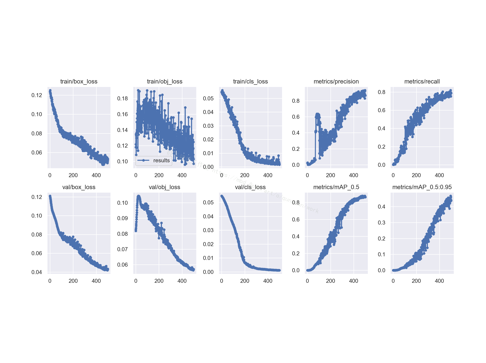
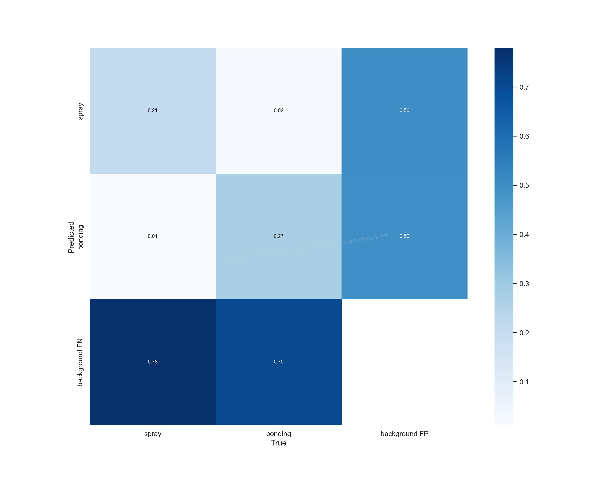
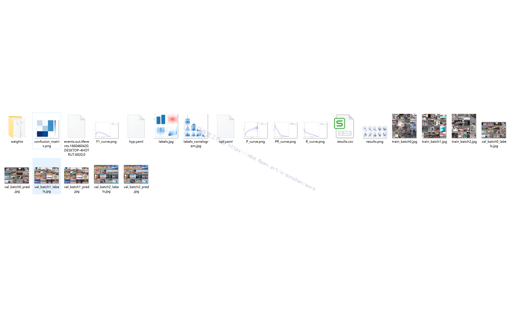
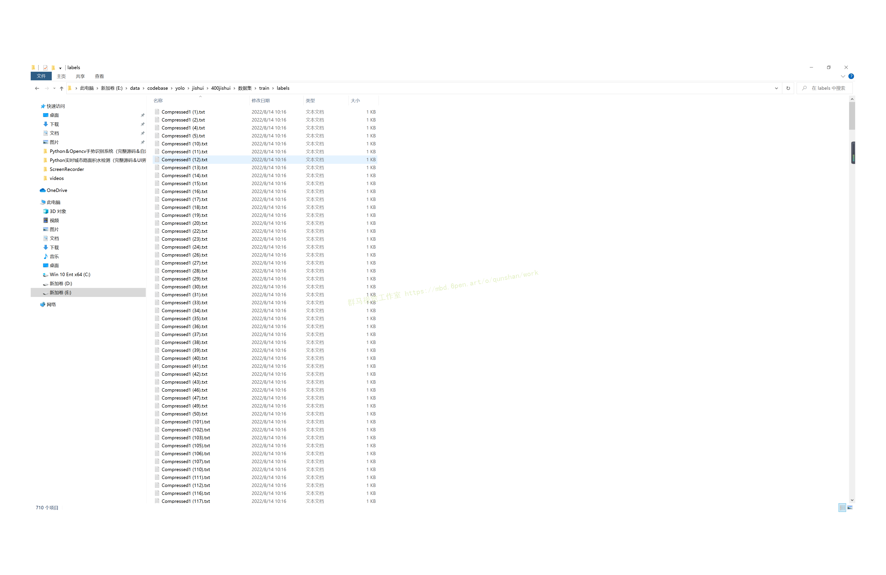

# 1.研究背景
随着我国经济的不断繁荣，大中城市的建设也在突飞猛进地高速发展，城市圈也在已经不断扩大。为了缓解交通压力和保证出行的畅通，许多城市建设了不少的立交桥和下穿隧道。 近年来，由强降雨引起的城市下穿隧道及立交桥下低洼处存在大量积水的现象时有发生，且有愈演愈烈的趋势。在我国南方多雨的城市，积水有的竟然高达一米以上，且长时间不能及时排走，给人们的出行带来了很大的不便，严重时竟引发行人的死亡和失踪事件。此现象已经引起市政、应急、防汛、路政等政府有关部门的高度关注。一方面要积极修建并管理好排水设施；另一方面建设城市道路积水监测系统，也极为必要，它既可以为决策机构的领导提供道路积水的实时信息，也为市政排水调度管理机构提供支持，还可以通过系统中的LED显示屏以及广播、电视等媒体为广大老百姓提供出行指南。

# 2.识别效果


# 3.视频演示
[Python实时城市路面积水检测（源码＆教程）](https://www.bilibili.com/video/BV1yN4y1A7DP/?vd_source=bc9aec86d164b67a7004b996143742dc)


# 4.训练结果
### Precision＆Recall＆Map＆So on



### 混淆矩阵



### 其他参数结果图



# 5.数据集




# 6.代码实现
```
"""定制resnet后面的层"""
def custom(input_size,num_classes,pretrain):
    # 引入初始化resnet50模型
    base_model = ResNet50(weights=pretrain,
                          include_top=False,
                          pooling=None,
                          input_shape=(input_size,input_size, 3),
                          classes=num_classes)
    #由于有预权重，前部分冻结，后面进行迁移学习
    for layer in base_model.layers:
        layer.trainable = False
    #添加后面的层
    x = base_model.output
    x = layers.GlobalAveragePooling2D(name='avg_pool')(x)
    x = layers.Dropout(0.5,name='dropout1')(x)
    #regularizers正则化层，正则化器允许在优化过程中对层的参数或层的激活情况进行惩罚
    #对损失函数进行最小化的同时，也需要让对参数添加限制，这个限制也就是正则化惩罚项，使用l2范数
    x = layers.Dense(512,activation='relu',kernel_regularizer= regularizers.l2(0.0001),name='fc2')(x)
    x = layers.BatchNormalization(name='bn_fc_01')(x)
    x = layers.Dropout(0.5,name='dropout2')(x)
    #40个分类
    x = layers.Dense(num_classes,activation='softmax')(x)
    model = Model(inputs=base_model.input,outputs=x)
    #模型编译
    model.compile(optimizer="adam",loss = 'categorical_crossentropy',metrics=['accuracy'])
    return model
```
```
class Net():
    def __init__(self,img_size,gar_num,data_dir,batch_size,pretrain):
        self.img_size=img_size
        self.gar_num=gar_num
        self.data_dir=data_dir
        self.batch_size=batch_size
        self.pretrain=pretrain

    def build_train(self):
        """迁移学习"""
        model = resnet.custom(self.img_size, self.gar_num, self.pretrain)
        model.summary()

        train_sequence, validation_sequence = genit.gendata(self.data_dir, self.batch_size, self.gar_num, self.img_size)

        epochs=4
        model.fit_generator(train_sequence,steps_per_epoch=len(train_sequence),epochs=epochs,verbose=1,validation_data=validation_sequence,
                                     max_queue_size=10,shuffle=True)
        #微调,在实际工程中，激活函数也被算进层里，所以总共181层，微调是为了重新训练部分卷积层，同时训练最后的全连接层
        layers=149
        learning_rate=1e-4
        for layer in model.layers[:layers]:
            layer.trainable = False
        for layer in model.layers[layers:]:
            layer.trainable = True
        Adam =adam(lr=learning_rate, decay=0.0005)
        model.compile(optimizer=Adam, loss='categorical_crossentropy', metrics=['accuracy'])

        model.fit_generator(train_sequence,steps_per_epoch=len(train_sequence),epochs=epochs * 2,verbose=1,
            callbacks=[
                callbacks.ModelCheckpoint('./models/garclass.h5',monitor='val_loss', save_best_only=True, mode='min'),
                callbacks.ReduceLROnPlateau(monitor='val_loss', factor=0.1,patience=10, mode='min'),
                callbacks.EarlyStopping(monitor='val_loss', patience=10),],
            validation_data=validation_sequence,max_queue_size=10,shuffle=True)

        print('finish train,look for garclass.h5')
```
# 7.源码＆环境部署视频教程＆数据集＆自定义训练视频教程＆自定义UI界面
[实时城市路面积水面积检测](https://s.xiaocichang.com/s/0948ca)

# 8.参考文献
[1]马光红，吴怡。 智慧城市地下综合管廊工程监管模型与仿真[J]. 上海大学学报（自然科学版），：1-14.

[2]郭骅，侯柏屹，张文洁，王莹。 智慧城市数据运营中心：系统概念、建设要素和展望[J]. 情报杂志，：1-10.

[3]陈栋，张翔，陈能成。 智慧城市感知基站：未来智慧城市的综合感知基础设施[J]. 武汉大学学报（信息科学版），：1-39.

[4]周林兴，徐承来，宋大成。 智慧城市视域下政府数据质量优化反馈机制研究[J]. 情报杂志，：1-11.

[5]汤丽霞。 智慧城市建设中技术应用反思[J]. 合作经济与科技，2021,（11）：37-39.

[6]侯鲁民。 智慧城市深入建设对公众安全的影响[J]. 中国科技信息，2021,（11）：119-120.

[7]蔡委呈。 浅谈智慧城市下的景观智能化设计[J]. 智能建筑与智慧城市，2021,（05）：8-9.

[8]张赫，黄雅哲，张梦晓，亚萌，马巧珊。 基于三元主体的智慧城市评价指标体系研究--以天津为例[J]. 智能建筑与智慧城市，2021,（05）：22-25.

[9]杨超，梁起航，王震。 我国智慧城市建设中的问题与对策研究[J]. 智能建筑与智慧城市，2021,（05）：30-31.

[10]刘亦欣，王娟，张鹏，赵文浦。 基于CiteSpace的智慧城市建设研究文献可视化分析[J]. 智能建筑与智慧城市，2021,（05）：57-60.

---
#### 如果您需要更详细的【源码和环境部署教程】，除了通过【系统整合】小节的链接获取之外，还可以通过邮箱以下途径获取:
#### 1.请先在GitHub上为该项目点赞（Star），编辑一封邮件，附上点赞的截图、项目的中文描述概述（About）以及您的用途需求，发送到我们的邮箱
#### sharecode@yeah.net
#### 2.我们收到邮件后会定期根据邮件的接收顺序将【完整源码和环境部署教程】发送到您的邮箱。
#### 【免责声明】本文来源于用户投稿，如果侵犯任何第三方的合法权益，可通过邮箱联系删除。